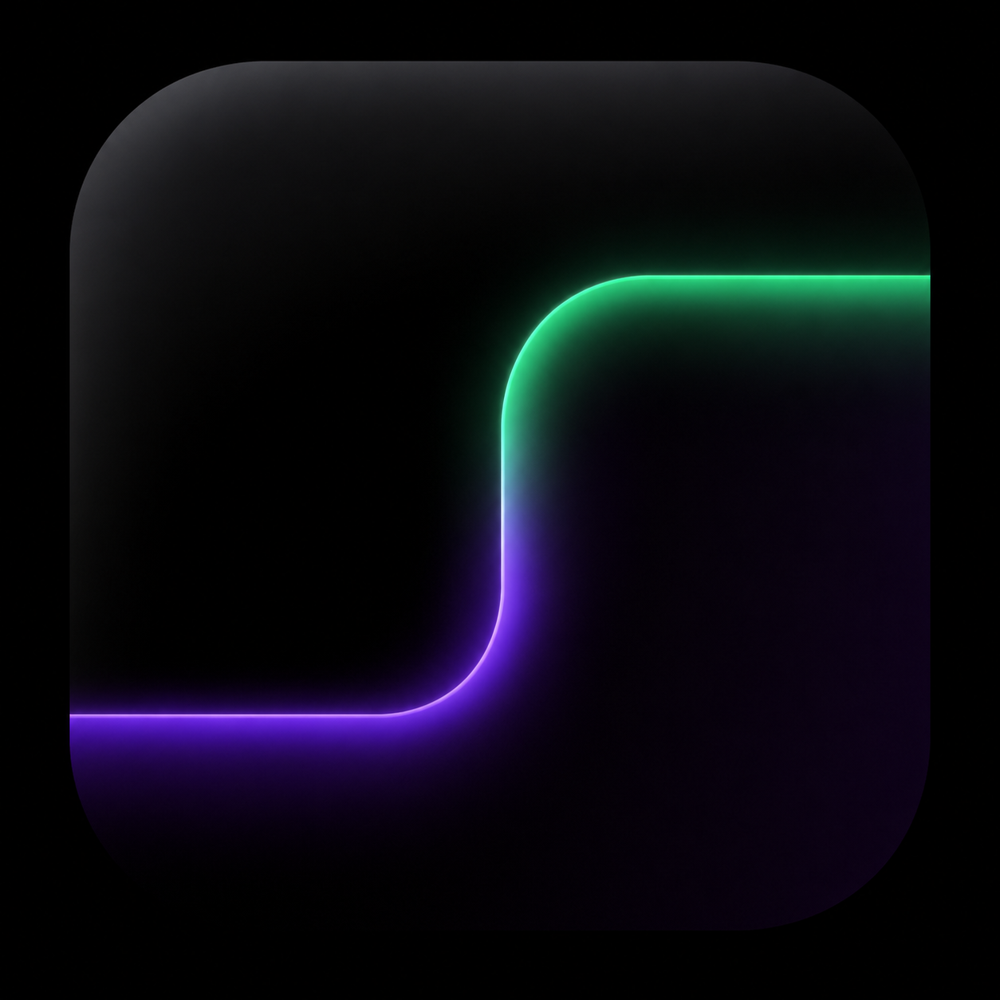
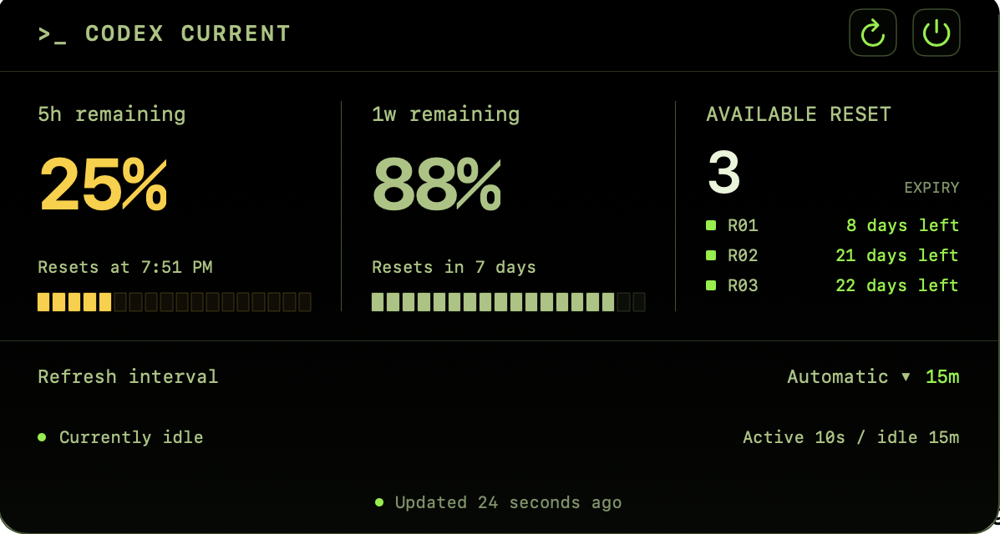
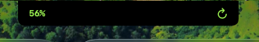

# Codex Current

<p align="center">
  <a href="README.md">English</a> · <a href="README.zh-CN.md">简体中文</a>
</p>

<p align="center">
  <a href="https://github.com/shawnzheng99/homebrew-tap"></a>
</p>

<p align="center">
  
</p>

<p align="center">
  A tiny native macOS utility that keeps your Codex usage limits close at hand.
</p>

It is simply a convenient way to glance at your Codex 5-hour and weekly limits, reset times, and available RESET credits without interrupting your work.

If that happens to fit your workflow, it might save you a few clicks — and perhaps a few tokens. ;)

Try it?
```sh
brew install --cask shawnzheng99/tap/codex-current
codex login
```

<p align="center">
  
</p>

<p align="center">
  
</p>

## What it does

- Shows your remaining Codex 5-hour and weekly usage at a glance.
- Shows reset times and available RESET credits when Codex provides them.
- Fits around the MacBook notch; on Macs without a notch, it lives in the menu bar.
- Refreshes more often while a local Codex desktop task is running and less often while idle.
- Uses a native SwiftUI interface with no ads, analytics SDK, or extra account.
- Follows your macOS language automatically, with English and Simplified Chinese included. Unsupported languages fall back to English.

That is essentially it. Codex Current is meant to be a small, focused tool rather than another dashboard you need to manage.

## Install — no developer experience required

### Homebrew

```sh
brew install --cask shawnzheng99/tap/codex-current
codex login
```

The cask installs Codex CLI as a dependency when Homebrew does not already manage it.

### Download the DMG

1. Make sure your Mac runs **macOS 14 Sonoma or later**.
2. Install [Codex CLI](https://github.com/openai/codex#quickstart), open Terminal, and run `codex login`.
3. Download the latest `.dmg` from [GitHub Releases](https://github.com/shawnzheng99/codexcurrent/releases/latest).
4. Open the DMG and drag **Codex Current** into **Applications**.
5. Launch Codex Current from Applications. It does not appear in the Dock; look at the top of your screen instead.

> The current prebuilt release supports Apple Silicon (`arm64`). An Intel Mac build has not been tested or published.

## How to use it

- **MacBook with a notch:** click the compact display near the notch to open the full panel. Click outside it to close.
- **Mac without a notch:** click the percentage in the menu bar and choose **Open panel** to open the panel.
- **Automatic refresh:** enabled by default. It checks every 10 seconds while a local Codex task is active and every 15 minutes while idle.
- **Manual refresh:** choose 30 seconds, 1, 5, 10, 15, or 30 minutes. Your preference is saved automatically.

Green means you have plenty left, orange means usage is getting low, and red means you are close to the limit.

## Privacy

Codex Current does not read or store your Codex login token. Its own code contains no analytics, telemetry, advertising, or direct network requests.

It does two local things:

1. Starts your installed `codex app-server --stdio` process and requests `account/rateLimits/read`.
2. In automatic mode, reads task lifecycle fields from `CODEX_HOME/thread_history_1.sqlite` — normally `~/.codex/thread_history_1.sqlite` — to determine whether a local Codex desktop task is active.

It does not request task titles, prompts, or responses. Codex CLI itself may communicate with OpenAI to retrieve account usage; that behavior belongs to Codex CLI and your existing Codex login.

## Frequently asked questions

### Why is there no Dock icon?

That is intentional. Codex Current is a notch/menu-bar utility and runs as a macOS accessory app.

### Why does it say that Codex CLI is not signed in?

Open Terminal, run `codex login`, complete the sign-in flow, and then ask Codex Current to check again.

### Does it read my conversations?

No, based on the current implementation. Its SQL query reads only task status, ordering, and start/end lifecycle fields. It does not query conversation content.

### Why is the task status unknown?

The automatic mode relies on an internal local database used by Codex desktop. If the database is missing or its schema changes, Codex Current reports the status as unknown and falls back to a slower refresh interval. It does not guess. Cloud tasks, remote-host tasks, and standalone CLI tasks are not detected.

### Why did usage suddenly stop updating?

Check that Codex CLI is installed, signed in, and up to date. Codex Current uses an App Server interface that may change with future Codex CLI versions.

## Build from source

Install Xcode, then run:

```sh
git clone https://github.com/shawnzheng99/codexcurrent.git
cd codexcurrent
zsh scripts/run-debug.sh
```

Run tests and create a local ad-hoc-signed build with:

```sh
swift test
zsh scripts/build-app.sh
```

The debug executable can also render sample UI images for layout checks:

```sh
.build/debug/CodexCurrent --render-preview
```

The images are written to `/tmp/codex-current-ui-qa/`.

## Maintainer release build

To create a Developer ID-signed, notarized DMG:

```sh
CODE_SIGN_IDENTITY="Developer ID Application: Your Name (TEAMID)" \
NOTARY_PROFILE="codex-current-notary" \
zsh scripts/release-dmg.sh
```

Store notarization credentials in the macOS Keychain with `xcrun notarytool store-credentials`. Never commit certificates, passwords, API private keys, `.env` files, or notarization credentials.

## Contributing

Issues and pull requests are welcome. Before submitting code, run `swift test` and make sure the commit contains no local paths, login credentials, signing files, or build artifacts.

## License

[MIT License](LICENSE)

## Disclaimer

Codex Current is an independent, unofficial community project. It is not affiliated with, sponsored by, or endorsed by OpenAI. Codex is a product name of OpenAI.
