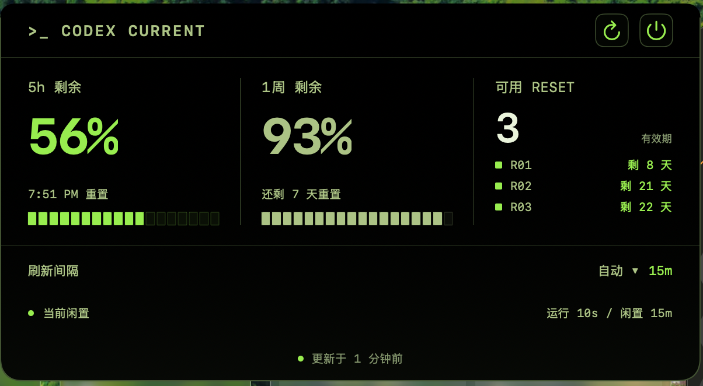

# Codex Current

<p align="center">
  <a href="README.md">English</a> · <a href="README.zh-CN.md">简体中文</a>
</p>

<p align="center">
  <a href="https://github.com/shawnzheng99/homebrew-tap"></a>
</p>

<p align="center">
  
</p>

<p align="center">
  一个把 Codex 额度放在刘海中的原生 macOS 小工具。
</p>

让你不用打断工作，就能顺手看一眼 Codex 的 5 小时和每周额度、重置时间，以及可用的 RESET 次数。

如果它刚好满足你的需求，或许可以帮你少点几下鼠标，也省下一点 token。;)

试一下?
```sh
brew install --cask shawnzheng99/tap/codex-current
codex login
```

<p align="center">
  
</p>

<p align="center">
  
</p>

## 它能做什么？

- 一眼查看 Codex 5 小时和每周剩余额度。
- 在 Codex 提供数据时显示重置时间、可用 RESET 数量与有效期。
- 自动贴合 MacBook 刘海；没有刘海的 Mac 则使用标准菜单栏。
- 本地 Codex 桌面任务运行时更频繁地刷新，闲置时降低刷新频率。
- 使用原生 SwiftUI，无广告、无分析 SDK，也不需要额外注册账号。
- 自动跟随 macOS 系统语言，内置英语和简体中文；其他语言默认显示英语。

差不多就是这些。Codex Current 的目标是做一个安静、专注的小工具，而不是再增加一个需要管理的仪表盘。

## 安装——不需要开发经验

### Homebrew

```sh
brew install --cask shawnzheng99/tap/codex-current
codex login
```

如果 Homebrew 尚未管理 Codex CLI，这个 Cask 会自动将它作为依赖安装。

### 下载 DMG

1. 确认 Mac 已安装 **macOS 14 Sonoma 或更高版本**。
2. 安装 [Codex CLI](https://github.com/openai/codex#quickstart)，打开“终端”并运行 `codex login`。
3. 从 [GitHub Releases](https://github.com/shawnzheng99/codexcurrent/releases/latest) 下载最新的 `.dmg`。
4. 打开 DMG，把 **Codex Current** 拖进 **Applications（应用程序）**。
5. 从“应用程序”启动 Codex Current。它不会出现在 Dock，请查看屏幕顶部。

> 当前预编译版本支持 Apple Silicon (`arm64`)。Intel Mac 版本尚未经过测试，也没有发布安装包。

## 怎么使用？

- **有刘海的 MacBook：**点击刘海附近的收起界面打开完整面板，点击面板外部即可收起。
- **没有刘海的 Mac：**点击菜单栏中的百分比，再选择“展开面板”。
- **自动刷新：**默认开启。本地 Codex 任务运行时每 10 秒检查一次，闲置时每 15 分钟检查一次。
- **手动刷新：**可选择 30 秒、1、5、10、15 或 30 分钟，设置会自动保存。

绿色表示额度充足，橙色表示剩余较少，红色表示快要用完。

## 隐私

Codex Current 不读取或保存 Codex 登录 Token。它自己的代码中没有分析、遥测、广告或直接网络请求。

它会在本地进行两项操作：

1. 启动已经安装的 `codex app-server --stdio`，请求 `account/rateLimits/read`。
2. 在自动模式下，读取 `CODEX_HOME/thread_history_1.sqlite`——通常是 `~/.codex/thread_history_1.sqlite`——中的任务生命周期字段，判断本机 Codex 桌面任务是否正在运行。

它不会请求任务标题、提示词或回答内容。Codex CLI 本身可能会与 OpenAI 通信以获取账号额度；这属于 Codex CLI 和你现有登录状态的行为。

## 常见问题

### 为什么 Dock 里没有图标？

这是设计如此。Codex Current 是刘海/菜单栏工具，以 macOS 辅助应用的形式运行。

### 为什么提示 Codex CLI 尚未登录？

打开“终端”，运行 `codex login` 并完成登录，然后回到 Codex Current 重新检查。

### 它会读取我的对话吗？

按当前实现，不会。SQL 只查询任务状态、顺序、开始时间和结束时间等生命周期字段，不查询对话内容。

### 为什么显示“任务状态未知”？

自动模式依赖 Codex 桌面端的本地内部数据库。如果数据库不存在或结构发生变化，Codex Current 会如实显示未知，并退回较慢的刷新频率。它不会猜测任务状态。云端、远程主机和独立 CLI 任务不在检测范围内。

### 为什么额度突然停止更新？

请确认 Codex CLI 已安装、已登录并更新到最新版本。Codex Current 使用的 App Server 接口可能随未来的 Codex CLI 版本变化。

## 从源码运行

先安装 Xcode，然后运行：

```sh
git clone https://github.com/shawnzheng99/codexcurrent.git
cd codexcurrent
zsh scripts/run-debug.sh
```

运行测试并生成本地临时签名版本：

```sh
swift test
zsh scripts/build-app.sh
```

调试版还可以生成带示例数据的 UI 排版检查图片：

```sh
.build/debug/CodexCurrent --render-preview
```

图片会保存到 `/tmp/codex-current-ui-qa/`。

## 维护者发布构建

生成 Developer ID 签名并经过 Apple 公证的 DMG：

```sh
CODE_SIGN_IDENTITY="Developer ID Application: Your Name (TEAMID)" \
NOTARY_PROFILE="codex-current-notary" \
zsh scripts/release-dmg.sh
```

请使用 `xcrun notarytool store-credentials` 把公证凭据保存到 macOS 钥匙串。不要提交证书、密码、API 私钥、`.env` 文件或公证凭据。

## 参与贡献

欢迎提交 Issue 和 Pull Request。提交代码前请运行 `swift test`，并确认提交中没有本机路径、登录凭据、签名文件或构建产物。

## 开源许可

[MIT License](LICENSE)

## 声明

Codex Current 是独立的非官方社区项目，与 OpenAI 无隶属、赞助或背书关系。Codex 是 OpenAI 的产品名称。
